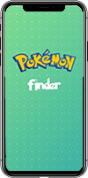
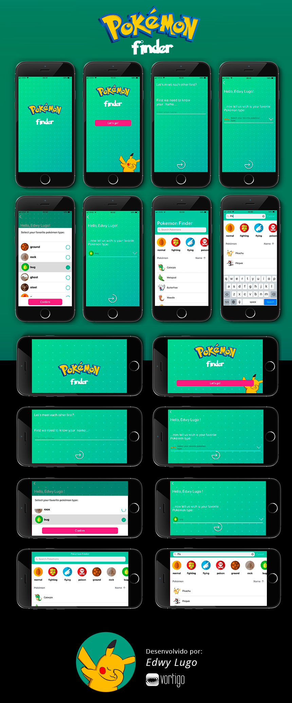

# Dev iOS Vortigo

# Pokemon Finder #

### Requisitos ###

* Xcode 
* Versão: iOS 12.2

### Instalação e Configurações ###

1. Instale os seguintes pods via terminal:
* pod 'AlamofireObjectMapper', '~> 5.2'
* pod 'AlamofireImage', '~> 3.5'

### Modelos de iPhone Compatíveis ###

| 5c | 5S | 6 | 6 Plus | 6S | 6S Plus | SE | 7 | 7 Plus | 8 | 8 Plus | X | XR | XS |
| :---: | :---: | :---: | :---: | :---: | :---: | :---: | :---: | :---: | :---: | :---: | :---: | :---: | :---: |
|  |  |  |  |  |  |  |  |  |  |  |  |  |  |

### iOS suportado ###

| Modelo 		 | 5S 	| 6 	| 6 Plus | 6S   | 6S Plus | SE  | 7     | 7 Plus | 8  	| 8 Plus | X 	| XR 	| XS 	|
| :---: | :---: | :---: | :---: | :---: | :---: | :---: | :---: | :---: | :---: | :---: | :---: | :---: | :---: |
| `iOS 12` |	 |	 |	  |	 |	   |	 |	 |	  |	 |	  |	 |	 |	 |
| `iOS 11 Beta 10` | 	 |	 |	  |	 |	   |	 |	 |	  |	 |	  |	 |	|	|
| `iOS 10.3.3[14]` |	 |	 |	  |	 |	   |	 |	 |	  |	 |	  |	 |	 |	 |
| `iOS 9.3.5` 	 |	 |	 |	  |	 |	   |	 |	 |	  |	 |	  |	 |		|    |
| `iOS 8.4.1`	 |   | 	 |	  |	 |	   |	 |	 |	  |	 |		 |		|		|	 |
| `iOS 7.1.2[15]`  |   | 	 |	  |	 |	   |	 |	 |	  |	 |		 |		|		|	 |

## Siga as instruções para rodar o projeto. ##
1. Clone o repositório utilizando Sourcetree.
2. Instale o Xcode.
3. Abra o Xcode, click em 'Open... e selecione o projeto PokemonFinder.xcworkspace. 
4. Rode o app. Click 'Run'.

## Funcionalidades:
1. Lista de Pokemons:
- Lista de Pokemons exibindo seus respectivos nomes e fotos.
 
2. Lista de Types:
- Lista de Types exibindo os tipos de pokemon.

3. Filtro de ordenação:
- Filtro de pokemons por order alfabética. 
 
4. Buscar:
- Pesquise seu Pokemon favorito.
 
### Screenshots ###

